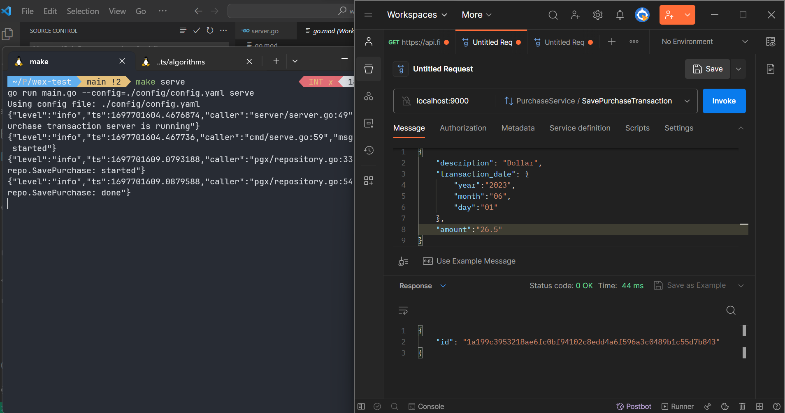

# wex-test

A gRPC based service to handle Save & Get purchase transaction.

## Getting started

Please install & run `docker` along with `docker-compose` in your machine (e.g., Rancher Desktop, Docker Desktop, Podman Desktop). Then executes:

```bash
# initialize local postgres database
make postgres
```

## Start the server
```bash
make serve
```

## Unit Tests
```bash
# clean test cache
make test-clean-cache

# execute unit tests
make test-unit
```

## Integration Test
```bash
# clean test cache
make test-clean-cache

# execute ingration test
make test-integration
```

## Database cleanup
```bash
make postgres-clean
```

## gRPC Contracts

If you need to check gRPC contracts, please redirect to [wex-test-upstream respository](https://github.com/jasonkwh/wex-test-upstream).

## Screenshots



